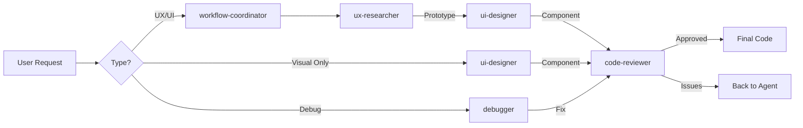

# Claude Code Sub-Agents for 14voices

This directory contains specialized sub-agents that work together to deliver high-quality, secure code.

## Agent Workflow



## Quality Assurance Pipeline

### 1. UX Phase (ux-researcher)

- Creates secure HTML prototypes
- Validates accessibility
- Tests user flows
- **Output**: Functional, tested prototype

### 2. UI Phase (ui-designer)

- Implements with modern frameworks
- Uses latest Next.js 15/React 19 patterns
- No deprecated APIs
- **Output**: Beautiful, performant component

### 3. Review Phase (code-reviewer)

- Security audit (XSS, CSRF, secrets)
- Framework compliance check
- Performance validation
- Documentation verification
- **Output**: Production-ready code

## Security Standards

All agents follow these security principles:

1. **No Hardcoded Secrets**
   - API keys in environment variables
   - Use Vercel KV for tokens
   - Stripe keys properly configured

2. **Input Validation**
   - Sanitize all user inputs
   - Use Zod schemas
   - Parameterized queries only

3. **Modern APIs Only**
   - Check docs via context7 MCP
   - No deprecated methods
   - Latest framework patterns

4. **Accessibility First**
   - WCAG 2.1 AA compliance
   - Keyboard navigation
   - Screen reader support

## Using the Agents

### Automatic Workflow

```
"Improve the checkout experience"
→ workflow-coordinator orchestrates:
  1. UX research & prototype
  2. UI implementation
  3. Security review
```

### Direct Agent Use

```
"Use code-reviewer to check my new component"
"Use ui-designer to create a hero section"
"Use ux-researcher to analyze the booking flow"
```

## Framework Versions

All agents are configured for:

- Next.js 15.0.3 (app router)
- React 19
- TypeScript 5 (strict mode)
- Payload CMS v3 beta
- Tailwind CSS v4

## Testing Integration

The code-reviewer automatically:

- Runs TypeScript diagnostics
- Checks for lint errors
- Validates imports
- Ensures error boundaries exist

## Continuous Improvement

Agents use memory MCP to:

- Remember common issues
- Track API changes
- Learn from past reviews
- Improve suggestions over time
